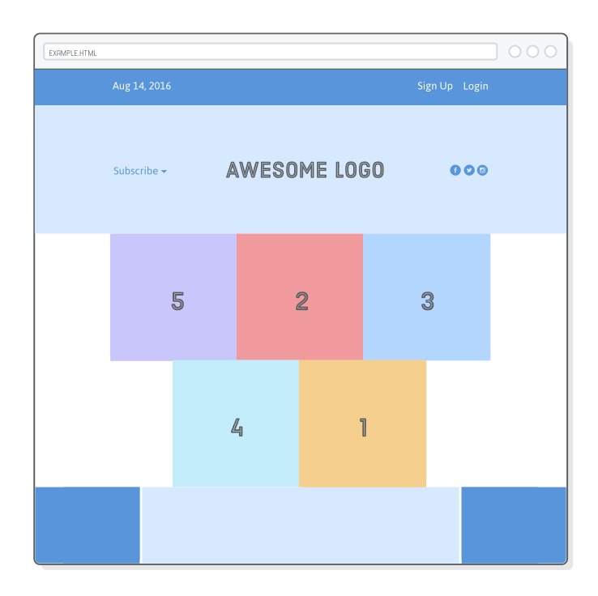

# Flexbox Practice (iih)

In this chapter, we’ll explore the entire flexbox layout model step by step. The example for this chapter is relatively simple, 
but it clearly demonstrates all of the important flexbox properties. We’ll wind up with something that looks like this: 

Source: https://www.internetingishard.com/html-and-css/flexbox/
